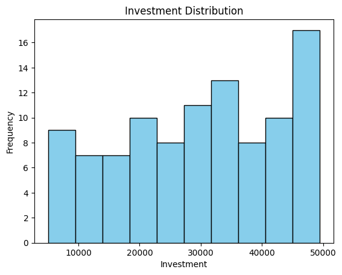
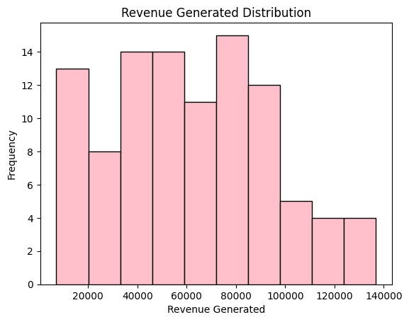
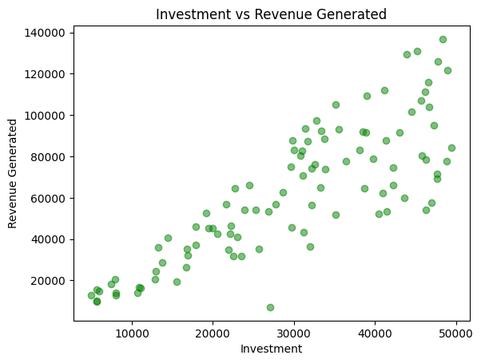
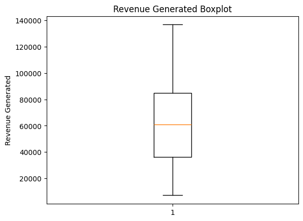

# Marketing Campaign Analysis

## **Introduction**
This project performs a comprehensive analysis of marketing campaigns using **Python**. It explores campaign performance, ROI, and investment efficiency through **data analysis, statistics, linear algebra, calculus, feature engineering**, and **SQL-like operations in Pandas**.  

The project helps businesses understand which campaigns are most effective, optimize investments, and make data-driven decisions.

---

## **Dataset**

**Source:** [Google Drive CSV file](marketing_campaign.csv)  

**Columns:**

| Column Name          | Description                          |
|---------------------|--------------------------------------|
| `campaign_id`       | Unique campaign ID                    |
| `campaign_name`     | Campaign title                        |
| `investment`        | Amount spent on campaign              |
| `revenue_generated` | Revenue earned                        |

---

## **Project Structure**

### **Part 1 – Basic Data Understanding (Pandas)**
- Load the CSV file into a Pandas DataFrame.
- Display the **first 10 rows** to preview data.
- Show **shape, column names, and data types**.
- Check for **missing values** and **duplicate rows**.
- Use `.describe()` to get **summary statistics** for numerical columns.

---

### **Part 2 – Exploratory Data Analysis (EDA)**

| Task | Description | Image |
|------|------------|-------|
| Histogram | Plot histograms for `investment` and `revenue_generated` to understand distributions. |     |
| Scatter Plot | Plot `investment` vs `revenue_generated` to visualize relationship. |  |
| Boxplot | Boxplot for `revenue_generated` to detect outliers. |  |

---

### **Part 3 – Statistics**
- Compute **mean, median, mode, variance, and standard deviation** for `investment`.
- Calculate **correlation** between `investment` and `revenue_generated`.
- Calculate probability: **percentage of campaigns with ROI > 50%**.

---

### **Part 4 – Linear Algebra & NumPy**
- Represent `investment` and `revenue_generated` as **NumPy arrays**.
- Perform **vector addition** and **subtraction**.
- Compute the **dot product** of investment and revenue arrays.
- Perform **matrix multiplication** with:
  - Features = `[investment, revenue_generated]`
  - Weight vector = `[0.5, 0.5]`

---

### **Part 5 – Calculus**
- ROI formula:  
  \[
  ROI = \frac{\text{revenue_generated} - \text{investment}}{\text{investment}} \times 100
  \]
- Use **SymPy** to calculate the **derivative of ROI with respect to investment**.
- Interpret how ROI changes when investment changes.

---

### **Part 6 – Feature Engineering**
- Create new column **ROI**.
- Create **High_Performance** column: 1 if ROI > 50%, else 0.
- Create **Revenue_Per_Thousand_Invested** column.
- Calculate **ROI quartile ranking** for campaigns.

---

### **Part 7 – SQL Simulation in Pandas**
- Filter **top 25% campaigns by ROI**.
- Sort campaigns by **ROI descending** and then `campaign_id` descending.

---

### **Part 8 – Insights**
- Identify **campaigns with top ROI**.
- Calculate **average ROI** for all campaigns.
- Analyze the **relationship between investment and revenue**.
- Determine **which ROI quartile performs the best**.

---

## **Technologies & Libraries**
- Python 3.x
- Pandas
- NumPy
- Matplotlib
- Seaborn
- SymPy
- SciPy (for statistics)

---

## **Conclusion**
This analysis provides insights into campaign performance, helping businesses make data-driven decisions. Key takeaways include:
- Identification of **high-performing campaigns** and ROI distribution.
- Understanding **investment vs revenue relationships**.
- Highlighting campaigns that maximize efficiency and profitability.
- The project demonstrates the application of **data analysis, statistical techniques, linear algebra, and calculus** in a real-world business dataset.
